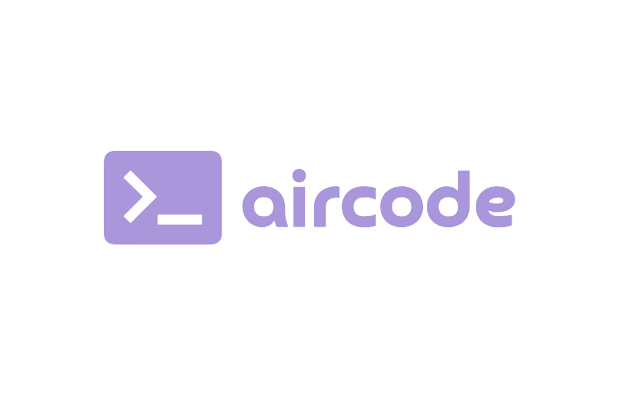

<h1 align="center">Simply Chocolate 🍫</h1>

<h2>Short description 🍁</h2>
<h4>Small online store that sells premium chocolate.

This project took us 1 month. Mostly, because of bugs.

</h4>

<h2>Technologies 📦 </h2>

<h4>HTML, SASS, JavaScript, Parcel, Npm, NodeJs</h4>
<h2>Libraries 🗂️</h2>
<h4>Axios, Video.js, Swiper, Slick Slider, Intl Tel Input</h4>

<h2>Authors 💳</h2>
<h4> <a href="https://github.com/0qsenxx">@0qsenxx (😏)</a>, <a href="https://github.com/m1xture"> @m1xture (😏) </a>, <a href="https://github.com/illyabezpaliy14"> @illyabezpaliy13 (☠️) </a>
</h4>

